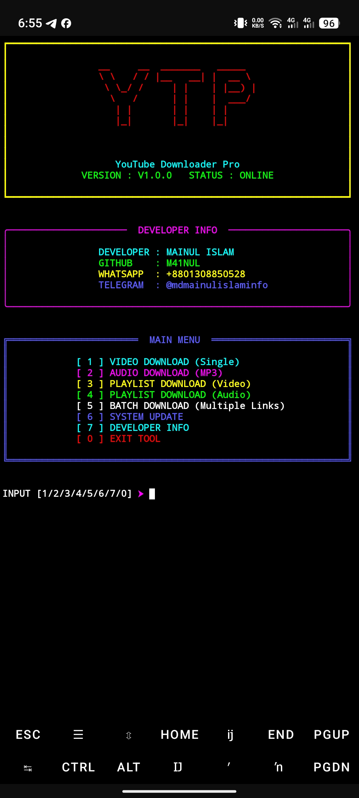

# 🚀 YTP - YouTube Downloader Pro

YTP is a powerful YouTube video & audio downloader with a modern, colorful CLI interface.  
Download videos in multiple qualities and audio as MP3 with live progress display.

---

## 📸 Screenshot



*Main interface with all download options*

---

## ✨ Features

- 🎬 **Video Download** – 4K, 2K, 1080p, 720p, 480p, 360p  
- 🎵 **Audio Download** – MP3 (320kbps, 192kbps, 128kbps)  
- 📁 **Playlist Download** – Download entire playlists (Video/Audio)  
- 📊 **Live Progress** – Real-time download progress with beautiful UI  
- 📱 **Mobile Friendly** – Works perfectly on Termux & Pydroid (Android)  
- 🎨 **Colorful Interface** – Rich, modern CLI design  
- 📂 **Auto Folder Organization** – Videos, Audio, Playlists separated  

---

# 🔧 Installation

## 📱 Termux (Android)

### 🔹 Step-by-Step Installation

Open Termux and run these commands one by one:

```bash
# 1. Grant storage permission
termux-setup-storage

# 2. Update packages and install dependencies
pkg update -y && pkg upgrade -y
pkg install python git ffmpeg -y

# 3. Install Python packages
pip install --upgrade pip
pip install yt-dlp rich pyfiglet

# 4. Go to SD card and clone repository
cd /sdcard
git clone https://github.com/M41NUL/YTP.git

# 5. Enter YTP folder
cd YTP

# 6. Run YTP
python ytp.py
```

---

### ⚡ Quick Install (Copy & Paste All at Once)

If you want to run everything at once, copy and paste this:

```bash
termux-setup-storage
pkg update && pkg upgrade -y
pkg install python git ffmpeg python-pip -y
pip install --upgrade pip
pip install yt-dlp rich pyfiglet
git clone https://github.com/M41NUL/YTP.git
cd YTP
python ytp.py
```
---

## 💻 Windows / Linux

```bash
# Install Python dependencies
pip install yt-dlp rich pyfiglet

# Clone and run
git clone https://github.com/M41NUL/YTP.git
cd YTP
python ytp.py
```

---

# 🎯 How to Use

1. Run the tool:

```bash
python ytp.py
```

2. Select an option:

- [1] Video Download  
- [2] Audio Download  
- [3] Playlist Download (Video)  
- [4] Playlist Download (Audio)  
- [5] Batch Download  
- [6] System Update  
- [7] Developer Info  
- [0] Exit  

3. Paste YouTube URL  
4. Select Quality  
5. Watch Live Progress  
6. Find downloads inside **YT Downloader Pro/** folder  

---

# 📁 Folder Structure

```
YT Downloader Pro/
│
├── Videos/           # Single video downloads
├── Audio/            # Single audio downloads
└── Playlists/        # Playlist downloads
    ├── Playlist Name (Video)/
    └── Playlist Name (Audio)/
```

---

# 🛠️ Requirements

- **yt-dlp** – YouTube downloading engine  
- **rich** – Beautiful CLI formatting  
- **pyfiglet** – ASCII banner generation  
- **ffmpeg** – Audio processing (optional but recommended)  

---

# 📝 Notes

- 4K/2K downloads may take longer and require more storage  
- Audio downloads are in M4A format (playable on any device)  
- Playlist downloads create separate folders automatically  
- On Termux, make sure to grant storage permission first  

---

# 👨‍💻 Developer

**Md. Mainul Islam**  
GitHub: https://github.com/M41NUL  

---

# 📬 Contact

- WhatsApp: +8801308850528  
- Telegram: @mdmainulislaminfo  
- Email: githubmainul@gmail.com  
- GitHub: M41NUL  

---

# 📄 License

MIT License

Copyright (c) 2026 MAINUL - X

Permission is hereby granted, free of charge, to any person obtaining a copy
of this software and associated documentation files (the "Software"), to deal
in the Software without restriction...

THE SOFTWARE IS PROVIDED "AS IS", WITHOUT WARRANTY OF ANY KIND.

---

# ⭐ Support

If you like this project, please give it a star on GitHub!

---

🚀 Happy Downloading!
